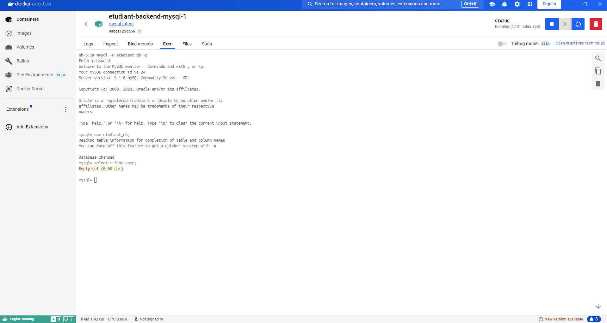

# EtuBibliotheque — Documentation technique

Application full-stack de gestion d'une bibliothèque, composée d'un back-end **Spring Boot 3** et d'un front-end **Angular 19**. Cette documentation couvre l'exploration du starter code, l'architecture, le lancement de l'application et les interactions front/back.

---

## Table des matières

1. [Prérequis](#1-prérequis)
2. [Cloner et ouvrir le projet](#2-cloner-et-ouvrir-le-projet)
3. [Architecture globale](#3-architecture-globale)
4. [Back-end — Spring Boot](#4-back-end--spring-boot)
5. [Front-end — Angular](#5-front-end--angular)
6. [Interactions front/back](#6-interactions-frontback)
7. [Lancement de l'application](#7-lancement-de-lapplication)
8. [Test — Enregistrement d'un agent](#8-test--enregistrement-dun-agent)
9. [Connexion à la base de données via Docker Desktop](#9-connexion-à-la-base-de-données-via-docker-desktop)
10. [Points de vigilance & observations](#10-points-de-vigilance--observations)

---

## 1. Prérequis

Assurez-vous d'avoir installé les outils suivants sur votre environnement local :

| Outil | Version requise |
|-------|----------------|
| Java | 21 |
| Maven | 3.9.3 |
| Node.js / npm | LTS compatible Angular 19 |
| Angular CLI | 19.x |
| Docker | dernière version stable |
| Docker Compose | intégré à Docker Desktop |
| Docker Desktop | dernière version stable |

Vérification rapide :

```bash
java -version
mvn -version
node -v
npm -v
ng version
docker -v
docker compose version
```

---

## 2. Cloner et ouvrir le projet

```bash
git clone https://github.com/Jallalben/EtuBibliotheque.git
cd EtuBibliotheque
```

Structure racine :

```
EtuBibliotheque/
├── backend/     ← API REST Spring Boot (port 8080)
└── frontend/    ← SPA Angular (port 4200)
```

---

## 3. Architecture globale

### Vue d'ensemble

```
NAVIGATEUR (localhost:4200)
        │
        │  POST /api/register
        │  POST /api/login
        ▼
ANGULAR (port 4200)
   proxy.conf.json  →  redirige /api/* vers http://localhost:8080
        │
        ▼
SPRING BOOT (port 8080)
   Spring Security → UserController → UserService → UserRepository
                                                          │
                                                          ▼
                                                   MySQL (Docker)
                                                   table: user
```

### Flux d'enregistrement (end-to-end)

```
Utilisateur remplit le formulaire
        │
        ▼
RegisterComponent.onSubmit()
        │ crée un objet Register
        ▼
UserService.register(user)
        │ HTTP POST /api/register (JSON)
        │ via proxy → localhost:8080
        ▼
UserController.register(@RequestBody @Valid RegisterDTO)
        │ validation Bean (@NotBlank)
        ▼
UserDtoMapper.toEntity(RegisterDTO) → User entity
        │
        ▼
UserService.register(user)
        │ vérifie login unique
        │ encode le mot de passe (BCrypt)
        │ sauvegarde en base
        ▼
UserRepository.save(user)
        │ INSERT INTO user (...)
        ▼
HTTP 201 CREATED ← retour au front
        │
        ▼
alert('SUCCESS!! :-)') [TODO: redirection vers /login]
```

---

## 4. Back-end — Spring Boot

### 4.1 Stack technique

| Élément | Détail |
|---------|--------|
| Framework | Spring Boot 3.5.5 |
| Langage | Java 21 |
| ORM | Spring Data JPA / Hibernate |
| Base de données | MySQL (via Docker) |
| Sécurité | Spring Security (JWT planifié) |
| Mapping DTO | MapStruct 1.6.3 |
| Réduction de code | Lombok 1.18.32 |
| Tests | JUnit 5 + Testcontainers 1.20.0 |

### 4.2 Organisation des fichiers

```
backend/src/main/java/com/openclassrooms/etudiant/
├── EtudiantBackendApplication.java        ← Point d'entrée Spring Boot
├── configuration/
│   ├── AppConfig.java                     ← Chargement des variables .env
│   ├── logging/
│   │   └── RequestLoggingFilterConfig.java ← Log des requêtes HTTP
│   └── security/
│       ├── SpringSecurityConfig.java       ← Règles de sécurité, BCrypt, sessions
│       └── CustomUserDetailService.java    ← Chargement utilisateur par login
├── controller/
│   └── UserController.java                ← Endpoints POST /api/register & /api/login
├── dto/
│   ├── RegisterDTO.java                   ← Données entrantes d'inscription
│   └── LoginRequestDTO.java               ← Données entrantes de connexion
├── entities/
│   └── User.java                          ← Entité JPA (implémente UserDetails)
├── handler/
│   ├── RestExceptionHandler.java          ← Gestion globale des erreurs HTTP
│   └── ErrorDetails.java                  ← Structure de réponse d'erreur
├── mapper/
│   └── UserDtoMapper.java                 ← Conversion RegisterDTO → User (MapStruct)
├── repository/
│   └── UserRepository.java                ← Accès base de données (JPA)
└── service/
    ├── UserService.java                   ← Logique métier (inscription, connexion)
    └── JwtService.java                    ← Génération de token JWT (TODO)
```

### 4.3 Configuration : `application.yml`

Les credentials de base de données sont masqués par des **variables d'environnement** définies dans le fichier `.env` :

```yaml
spring:
  datasource:
    url: jdbc:mysql://${DB_HOST}:${DB_PORT}/${DB_NAME}
    username: ${DB_USER}
    password: ${DB_PASSWORD}
  jpa:
    hibernate:
      ddl-auto: update    # Crée/met à jour le schéma automatiquement
```

> **Sécurité** : Le fichier `.env` ne doit **jamais** être commité. Il est ajouté au `.gitignore`.

### 4.4 Base de données : `compose.yaml`

Le fichier `compose.yaml` définit un conteneur MySQL démarré automatiquement avec Spring Boot :

```yaml
services:
  mysql:
    image: mysql:latest
    environment:
      MYSQL_DATABASE: etudiant_db
      MYSQL_USER: etudiant_db
      MYSQL_PASSWORD: etudiant_db
      MYSQL_ROOT_PASSWORD: root_password
    volumes:
      - db_data:/var/lib/mysql    # Persistance des données
    ports:
      - "3306:3306"
```

Spring Boot détecte automatiquement `compose.yaml` et démarre la base **avant** l'application (grâce à la dépendance `spring-boot-docker-compose`).

### 4.5 Entité `User`

```
Table: user
┌─────────────┬───────────────┬──────────────────────────┐
│ Colonne     │ Type          │ Contrainte               │
├─────────────┼───────────────┼──────────────────────────┤
│ id          │ BIGINT        │ PK, AUTO_INCREMENT        │
│ firstName   │ VARCHAR       │ NOT NULL                  │
│ lastName    │ VARCHAR       │ NOT NULL                  │
│ login       │ VARCHAR       │ UNIQUE, NOT NULL          │
│ password    │ VARCHAR       │ NOT NULL (BCrypt hashé)   │
│ created_at  │ DATETIME      │ Auto-rempli               │
│ updated_at  │ DATETIME      │ Auto-rempli               │
└─────────────┴───────────────┴──────────────────────────┘
```

`User` implémente `UserDetails` de Spring Security, ce qui permet son utilisation directe dans la chaîne d'authentification.

### 4.6 Endpoints exposés

| Méthode | Chemin | Accès | Description |
|---------|--------|-------|-------------|
| POST | `/api/register` | Public | Inscription d'un nouvel utilisateur |
| POST | `/api/login` | Public | Connexion (retourne un JWT — TODO) |
| GET | `/actuator/**` | Public | Health checks & métriques |
| Autres | `/**` | Authentifié | Nécessite un token JWT valide |

### 4.7 Sécurité

- **CSRF** : désactivé (API stateless)
- **Sessions** : `STATELESS` (JWT)
- **CORS** : désactivé côté back → géré par le proxy Angular en développement
- **Mots de passe** : hashés avec `BCryptPasswordEncoder`
- **JWT** : infrastructure présente (`JwtService`), implémentation à compléter

### 4.8 Gestion des erreurs

| Exception | Code HTTP | Cas d'usage |
|-----------|-----------|-------------|
| `IllegalArgumentException` | 400 | Login déjà utilisé, données invalides |
| `BadCredentialsException` | 401 | Mauvais identifiants |
| `AccessDeniedException` | 403 | Accès non autorisé |
| `Exception` (générique) | 500 | Erreur serveur inattendue |

---

## 5. Front-end — Angular

### 5.1 Stack technique

| Élément | Détail |
|---------|--------|
| Framework | Angular 19.2.0 |
| Langage | TypeScript 5.7 |
| UI | Angular Material 19.2.19 |
| Forms | Reactive Forms |
| HTTP | HttpClient |
| Tests | Jest 29.7.0 |

### 5.2 Organisation des fichiers

```
frontend/src/app/
├── app.component.ts          ← Composant racine (<router-outlet>)
├── app.config.ts             ← Configuration : HttpClient, Router, ZoneJS
├── app.routes.ts             ← Routes : '' → AppComponent, 'register' → RegisterComponent
├── core/
│   ├── models/
│   │   └── Register.ts       ← Interface TypeScript du formulaire d'inscription
│   └── service/
│       ├── user.service.ts       ← Appel HTTP POST /api/register
│       └── user-mock.service.ts  ← Service mock pour les tests (retourne Observable vide)
├── pages/
│   └── register/
│       ├── register.component.ts   ← Logique du formulaire d'inscription
│       └── register.component.html ← Template Material (card + form + validation)
└── shared/
    └── material.module.ts    ← Centralisation des imports Angular Material
```

### 5.3 Proxy de développement : `proxy.conf.json`

```json
{
  "/api": {
    "target": "http://localhost:8080",
    "secure": false
  }
}
```

Toutes les requêtes Angular vers `/api/*` sont **transparentes** redirigées vers Spring Boot sur le port 8080. Cela évite les problèmes CORS en développement.

### 5.4 Composant `RegisterComponent`

Le formulaire d'inscription utilise les **Reactive Forms** Angular :

```typescript
registerForm = this.formBuilder.group({
  firstName: ['', Validators.required],
  lastName:  ['', Validators.required],
  login:     ['', Validators.required],
  password:  ['', Validators.required]
});
```

Comportement du `onSubmit()` :
1. Valide le formulaire côté client
2. Construit l'objet `Register`
3. Appelle `UserService.register()`
4. Affiche une alerte en cas de succès (à remplacer par une navigation vers `/login`)

### 5.5 Routes

| URL | Composant |
|-----|-----------|
| `http://localhost:4200/` | `AppComponent` |
| `http://localhost:4200/register` | `RegisterComponent` |

---

## 6. Interactions front/back

### Communication HTTP

```
Angular (port 4200)
    │
    │  POST /api/register
    │  Content-Type: application/json
    │  {
    │    "firstName": "Marie",
    │    "lastName": "Dupont",
    │    "login": "marie.dupont",
    │    "password": "motdepasse"
    │  }
    │
    ▼  [proxy.conf.json redirige vers :8080]
    │
Spring Boot (port 8080)
    │
    │  → Validation @Valid (NotBlank sur tous les champs)
    │  → Conversion DTO → Entité (MapStruct)
    │  → Vérification unicité du login (findByLogin)
    │  → Encodage mot de passe (BCrypt)
    │  → INSERT en base (JPA)
    │
    ▼
    HTTP 201 CREATED (succès)
    HTTP 400 BAD_REQUEST (login existant ou champ vide)
```

### Absence de CORS en développement

Le proxy Angular (`proxy.conf.json`) fait en sorte que les requêtes HTTP partent de `localhost:4200` vers `localhost:4200/api/...`, puis sont retransmises au back-end. Le navigateur ne voit jamais de requête cross-origin.

---

## 7. Lancement de l'application

### 7.1 Démarrer le back-end

```bash
cd backend

# Vérifier que Docker Desktop est démarré

# Lancer le back-end (Docker Compose + Spring Boot démarrent ensemble)
./mvnw spring-boot:run
```

> Sur Windows, utilisez `mvnw.cmd spring-boot:run`

Spring Boot détecte `compose.yaml` et démarre automatiquement le conteneur MySQL avant l'application.

**Vérification** : L'application est prête quand les logs affichent :
```
Started EtudiantBackendApplication in X.XXX seconds
```

### 7.2 Démarrer le front-end

```bash
cd frontend

# Installer les dépendances (première fois uniquement)
npm install

# Lancer le serveur de développement
npm run start
```

Le front-end est accessible sur : **http://localhost:4200**

### 7.3 Lancer les tests

**Back-end** (nécessite Docker pour Testcontainers) :
```bash
cd backend
./mvnw test
```

**Front-end** :
```bash
cd frontend
npm run test
# ou en mode watch :
npm run test:watch
```

---

## 8. Test — Enregistrement d'un agent

### Étapes

1. Assurez-vous que le back-end **et** le front-end sont démarrés
2. Ouvrez votre navigateur sur : **http://localhost:4200/register**
3. Remplissez le formulaire :
   - Prénom : `Marie`
   - Nom : `Dupont`
   - Login : `marie.dupont`
   - Mot de passe : `motdepasse`
4. Cliquez sur **Register**
5. Une alerte `SUCCESS!! :-)` doit apparaître

### Vérification dans les logs back-end

Les logs Spring Boot doivent afficher :

```
INFO  c.o.etudiant.service.UserService : Registering new user
INFO  o.s.web.filter.CommonsRequestLoggingFilter : REQUEST DATA: POST /api/register, ...
```

---

## 9. Connexion à la base de données via Docker Desktop

### Depuis Docker Desktop

1. Ouvrez **Docker Desktop**
2. Cliquez sur le conteneur MySQL (ex: `etudiantbackend-mysql-1`)
3. Onglet **"Exec"**
4. Tapez les commandes suivantes :

```bash
# Se connecter à MySQL
mysql -u etudiant_db -petudiant_db

# Sélectionner la base
USE etudiant_db;

# Consulter la table user
SELECT * FROM user;
```

Vous devez voir le nouvel utilisateur avec son mot de passe hashé en BCrypt.

### Capture de référence




---

## 10. Points de vigilance & observations

### Observations architecturales

| Couche | Observation |
|--------|-------------|
| **Sécurité** | `JwtService.generateToken()` retourne `null` (TODO) — à implémenter |
| **Login endpoint** | Annotation `@RequestBody` manquante dans `UserController.login()` |
| **Password check** | `passwordEncoder.matches(password, password)` compare le mot de passe à lui-même (bug) |
| **CORS** | Désactivé en back — la configuration pour la production sera nécessaire |
| **JWT Filter** | Commenté dans `SpringSecurityConfig` — à activer quand JwtService sera implémenté |

### Points positifs du starter code

- Architecture en couches propre (Controller → Service → Repository)
- Gestion d'erreurs centralisée avec `RestExceptionHandler`
- Validation des données entrantes avec `@Valid` + `@NotBlank`
- Séparation DTO / Entité via MapStruct
- Proxy Angular bien configuré pour le développement local
- `User` implémente directement `UserDetails` (intégration Spring Security native)
- Tests d'intégration avec Testcontainers (vraie base de données)

### Ce qui est à compléter (prochaines étapes)

- [ ] Implémenter `JwtService.generateToken()`
- [ ] Corriger le bug de vérification du mot de passe dans `UserService.login()`
- [ ] Ajouter `@RequestBody` sur l'endpoint login
- [ ] Activer le filtre JWT dans la chaîne de sécurité
- [ ] Côté front : stocker le token JWT (localStorage / sessionStorage)
- [ ] Côté front : ajouter un intercepteur HTTP pour injecter le token
- [ ] Côté front : remplacer l'`alert()` par une navigation vers `/login`
- [ ] Configurer CORS pour la production

---

## Conventional Commits

Ce projet suit la convention [Conventional Commits](https://www.conventionalcommits.org/en/v1.0.0/).

### Format

```
<type>(<scope>): <description>

[body optionnel]

[footer optionnel]
```

### Types utilisés

| Type | Usage |
|------|-------|
| `feat` | Nouvelle fonctionnalité |
| `fix` | Correction de bug |
| `docs` | Documentation uniquement |
| `refactor` | Refactoring sans ajout de fonctionnalité |
| `test` | Ajout ou modification de tests |
| `chore` | Tâches de maintenance (dépendances, config) |
| `style` | Formatage, indentation (pas de logique) |

### Exemples

```
feat(auth): implement JWT token generation in JwtService

fix(auth): correct password comparison in UserService login method

docs(readme): add architecture analysis and launch instructions

chore(backend): add .env to .gitignore to avoid credential leaks
```

---

*Documentation générée lors de l'exploration du starter code — étape 1 du projet EtuBibliotheque.*
